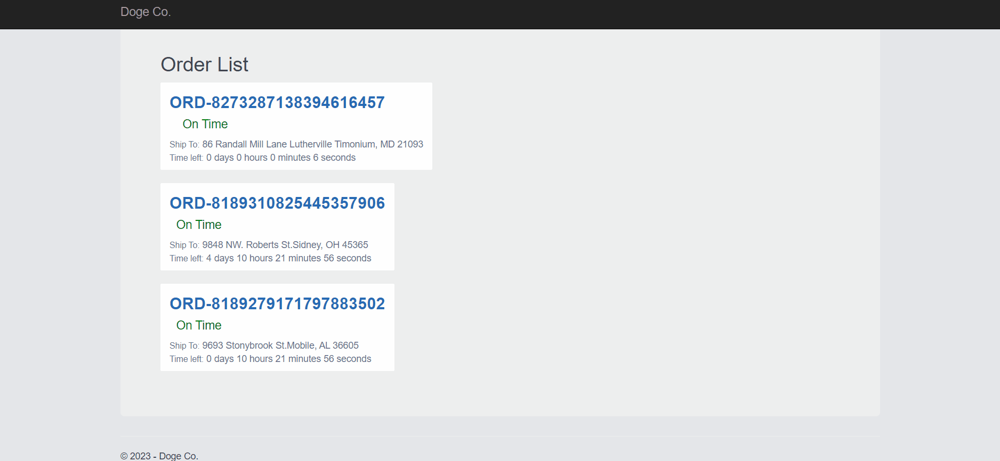

## Hello #FutureShaper
I am glad that you passed the first stages of the interview process 🎉🥳. Now is the time to show us what you got! 

## The objective: 
Deploy an ASP.NET web application along with a Windows service.

# Tech Stack:

- Visual Studio 2019 Community Edition or above
- .NET Framework 4.8 SDK & Runtime
- C# 7.3
- VisualBasic 16

# Problem description:
The **Delivering Orders with Great Efficiency** enterprise (D.O.G.E. for short) needs to deploy their new order management solution. Unfortunately, there is no active development team that can perform a Knowledge Transfer (KT) of this solution to you and all you have is the following information:
- The solution was developed in .NET Framework 4.8
- For now, it will consist of two main components:
    - **ASP.NET Web Application**: C# web application. This component retrieves the orders from the Windows Service.
    - **Windows Service**: VisualBasic Windows Service. Sends the data to our ASP .NET Web Application.

# Instructions
## ASP.NET Web Application
- The application should be developed in C# .NET Framework 4.8
- Create the following screen in ASP.NET

## Windows Service
- This service must be developed in VB .NET Framework 4.8
- The model of the order object can be found in the class library *Doge.Model*
- Create the Windows Service from scratch.

# Submission
- You should submit your code in a GitHub fork repository
-	Commit as much as you want, remember to show good practices. 
- Try to code as clean as possible. Think of it as if you were tasked in real life.

Good Luck!